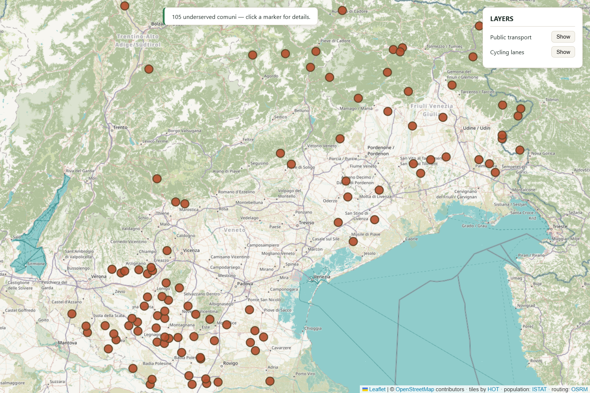
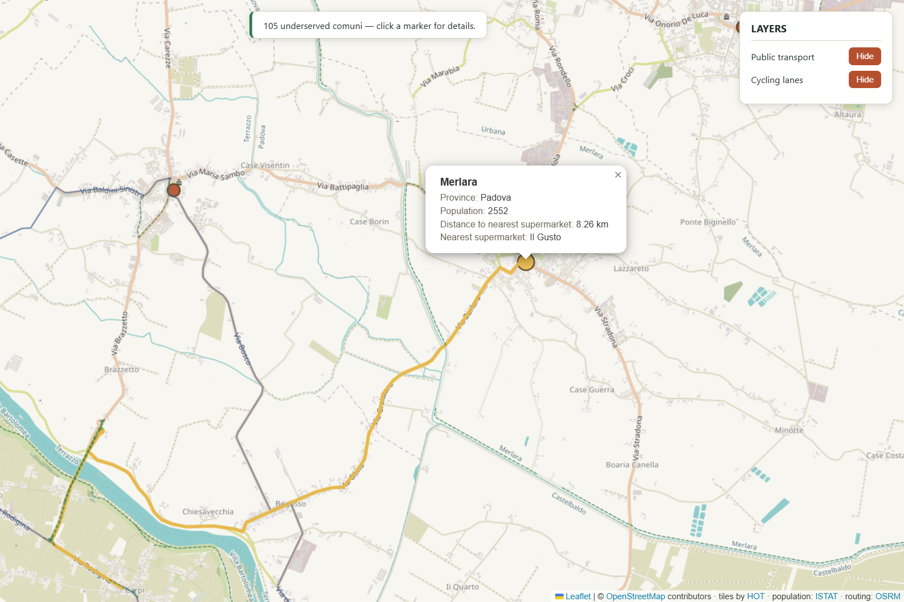

# Food Desert Analysis — Northeastern Italy

**Which towns have limited access to grocery stores?**

This pipeline answers that question systematically across Veneto, Trentino-Alto
Adige and Friuli-Venezia Giulia — 1,054 municipalities — using real routed
walking distances rather than straight-line proximity, and weighting the result
by the population most affected by it.

**[→ Explore the interactive map](https://riccardoperana.github.io/Food-Desert-Analysis-North-Eastern-Italy/)**

<p align="center">
  
</p>
<p align="center">
  <em>Every town with no grocery shop in a 3&nbsp;km radius.</em>
</p>

---

## Why this matters

Italy has one of the world's oldest populations, and the skew is sharpest in
small towns that younger residents have left.

For a mobile adult with a car, a 6 km trip for groceries is an errand. For
someone in their eighties who no longer drives, it is the difference between
independence and dependence — on a relative, a neighbour, or nothing.

This project began from a small local observation: some towns have no shop, the
nearest one is in the next town over, and the road between them often has no
sidewalk, no cycle lane and no useful bus. That is easy to notice about one
town. It is impossible to check by hand across a thousand.

**Distance alone is not the finding.** A commuter town of 4,000 with a median
age of 38 and a mountain village of 400 where a third of residents are over 75
are not the same problem. Every result here is weighted by the number of
residents aged 65 or over, so the ranking reflects where the burden is
*largest*, not merely where it is most extreme.

---

## What it found

| | |
|---|---|
| Towns analysed | **1,054** |
| Towns with no shop and a walk of over 3 km | **104** |
| Residents living in them | **207,126** |
| Of whom aged 65 or over | **52,708 (25.4%)** |

The most affected town is **Illasi** (Verona): 1,282 residents aged 65+, with a
5.7 km walk to the nearest supermarket. The starkest is **Drenchia** (Udine) —
89 residents, **53.9% of them over 65**, with an ageing index of 2,400. That is
twenty-four pensioners for every child under fifteen.

---


## Methodology

A town is reported as underserved when **both** conditions hold:

1. **It has no supermarket or minimarket within its own boundary** (plus a
   500 m margin, and a 1.5 km radius around the town centre as a safety net
   for imprecise boundary data).
2. **The routed walking distance to the nearest reachable shop exceeds 3 km.**

### Why 3 km

Three kilometres is roughly half an hour's walk for an elderly person. There
and back is an hour — which is also the typical frequency of extra-urban buses
in these regions.

Past that point, walking stops being the sensible option: you would have been
better off waiting for the bus. The threshold marks where a walk stops being a
walk and becomes a journey that has to be planned around a timetable.

### Why routed distance, not straight-line

Papozze, on the Po delta, has a shop 2.8 km away in a straight line. It is on
the far bank, with no bridge nearby: the real walking route is **28.7 km**. A
different shop 7.1 km away straight-line is reachable in about 8 km on foot.

Straight-line proximity is not access. Every distance here is a real pedestrian
route computed by [OSRM](http://project-osrm.org/) over the actual road and
path network. The pipeline routes to the **five** nearest candidate shops and
keeps the shortest genuine walk, precisely so that an unreachable neighbour
cannot masquerade as the closest one.

### Why an equal-area projection

Distances are computed in EPSG:3035 (ETRS89 / LAEA Europe), in metres. Measuring
in raw latitude/longitude degrees inflates east–west distances by roughly 44% at
this latitude, which is enough to pick the wrong nearest shop.

### What is flagged rather than reported

Results at or beyond 10 km are flagged for manual review and excluded from the
headline figures and the map, though they remain in the spreadsheet as a full
audit trail. Remote mountain towns genuinely can be that far from a shop — but
so can a routing artefact, and the two are indistinguishable without checking.
Three of the 104 results are currently flagged.

---

## Data sources

| Source | Used for | Licence |
|---|---|---|
| [OpenStreetMap](https://www.openstreetmap.org/copyright) (Geofabrik extract) | Town boundaries, shop locations, cycle lanes, transport routes | ODbL |
| [ISTAT](https://www.istat.it) — 2024 regional census | Population, age structure, ageing index | CC BY 4.0 |
| [OSRM](http://project-osrm.org/) | Pedestrian routing | BSD |

ISTAT workbooks are read **exactly as published**, with no manual editing —
download the same four files and you regenerate the same numbers.

All geographic data is read from a local OpenStreetMap extract rather than live
web queries, so a full run takes minutes rather than hours and does not depend
on the availability of free public query servers.

---

## Requirements

- **Python 3.9+**
- **Docker** (runs the OSRM routing engine)
- **~10 GB free disk space** — 500 MB extract, plus several GB of OSRM build
  products
- Windows, macOS or Linux. Commands below use PowerShell; adjust for your shell.

> ### ⚠️ Memory: 8 GB machines will struggle
>
> The heaviest step is not the analysis — it is reading the OpenStreetMap
> extract. `osmium` builds an in-memory index of every node coordinate in the
> file, which for the 500 MB Nord-Est extract needs roughly **1.5–3 GB of RAM**
> on its own, before GeoPandas loads anything.
>
> Building the OSRM routing graph is heavier still and briefly needs **4–6 GB**.
>
> **On 8 GB total:** close other applications, and run the one-time OSRM build
> separately from everything else rather than alongside it. It will work, but
> with little headroom.
>
> **On less than 8 GB, or for a larger extract**, switch `osmium` to a
> disk-backed node index. Every call site is marked in the code:
>
> ```python
> handler.apply_file(path, locations=True, idx="sparse_file_array,nodes.cache")
> ```
>
> Markedly slower, but with a near-flat memory profile.

---

## Quick start

```powershell
git clone https://github.com/RiccardoPerana/Food-Desert-Analysis-North-Eastern-Italy.git
cd Food-Desert-Analysis-North-Eastern-Italy

python -m venv venv
.\venv\Scripts\Activate.ps1
pip install -r requirements.txt
```

**1. Download the map extract** into `data/osm/`:

```powershell
Invoke-WebRequest -Uri "https://download.geofabrik.de/europe/italy/nord-est-latest.osm.pbf" `
                  -OutFile "data\osm\nord-est-latest.osm.pbf"
```

**2. Download the ISTAT workbooks** into `data/istat/`, from the
[2024 regional census release](https://www.istat.it/comunicato-territoriale/censimento-della-popolazione-dati-regionali-anno-2024/).
You need the "Allegato statistico" for Veneto, Friuli-Venezia Giulia, Trentino
and Alto Adige — four files, since Trentino-Alto Adige is published as two.

Filenames do not matter. Every `.xlsx` in the folder is loaded.

**3. Build the routing graph** (one-off, 10–40 minutes):

```powershell
docker run -t -v "${PWD}/data/osm:/data" osrm/osrm-backend osrm-extract -p /opt/foot.lua /data/nord-est-latest.osm.pbf
docker run -t -v "${PWD}/data/osm:/data" osrm/osrm-backend osrm-partition /data/nord-est-latest.osrm
docker run -t -v "${PWD}/data/osm:/data" osrm/osrm-backend osrm-customize /data/nord-est-latest.osrm
```

**4. Start the routing server** in its own terminal, and leave it running:

```powershell
docker run -t -i -p 5000:5000 -v "${PWD}/data/osm:/data" osrm/osrm-backend `
    osrm-routed --algorithm mld /data/nord-est-latest.osrm
```

**5. Check everything is in place, then run:**

```powershell
python run.py paths      # every input should read OK
python run.py all        # analyse, build map layers, publish
python run.py serve      # preview at http://localhost:8000
```

The first run builds caches (the town boundary step takes 30–60 minutes via
Nominatim); every run after that takes well under a minute.

---

## Commands

| Command | What it does |
|---|---|
| `python run.py analyze` | Run the analysis → `output/` |
| `python run.py layers` | Build cycle-lane and transport overlays |
| `python run.py publish` | Copy results into `docs/data/` for the live demo |
| `python run.py serve` | Preview the map exactly as it will be published |
| `python run.py diagnose "Town Name"` | Spot-check one town against cached and live data |
| `python run.py paths` | Show resolved paths and verify inputs exist |
| `python run.py all` | analyse → layers → publish |

Publishing is deliberately separate from analysis, so an experimental run
cannot silently become the live demo.

---

## Output

- `output/food_desert_towns.xlsx` — every result, sorted by vulnerability, with
  population, 65+ count, ageing index, distance and review flags
- `output/towns.geojson`, `output/routes.geojson` — map data
- `output/unroutable_towns.json` — towns with no walkable route to any candidate
- `docs/` — the published interactive map

<p align="center">
  
</p>
<p align="center">
  <em>Selecting a town draws its actual pedestrian route. With the cycle-lane
  layer on, you can see directly whether any safe infrastructure follows it —
  here, none does.</em>
</p>

<p align="center">
  
</p>
<p align="center">
  <em>Results ranked by vulnerability — residents aged 65+ multiplied by
  distance beyond the threshold. Amber rows are flagged for manual review.</em>
</p>

---

## Configuration

Everything lives in `food_desert/config.py`.

| Setting | Purpose |
|---|---|
| `TARGET_LEVEL` / `TARGET_REGIONS` | Area to analyse |
| `DISTANCE_THRESHOLD_KM` | The "too far" cutoff — default 3 km |
| `DISTANCE_REVIEW_THRESHOLD_KM` | Results at/beyond this are flagged for review — default 10 km |
| `ROUTING_CANDIDATE_COUNT` | How many nearby shops to route to before choosing — default 5 |
| `BORDER_BUFFER_KM` | How far past the study area to look for shops |
| `EXCLUDE_UNMATCHED_TOWNS` | Drop towns with no ISTAT match (i.e. outside the study area) |
| `OSM_PBF_PATHS` | Extracts to read; a list, so regions can be combined |
| `FORCE_REFRESH_CACHE` | Rebuild everything from scratch |

Settings marked `# SCALE HOOK (national)` are deliberate extension points for
running this at country scale, not dead code. Each states what work activating
it requires.

---

## Known limitations

- **The outer border.** The extract covers exactly the three target regions. A
  town on the outer edge whose nearest shop lies just across it — into
  Lombardy, Austria or Slovenia — will not see it. Internal borders between the
  three regions are fully handled. Adding a neighbouring extract to
  `OSM_PBF_PATHS` closes the gap.
- **Extra-urban public transport is absent** from the map. OpenStreetMap covers
  urban bus routes well and regional coach networks poorly; closing that gap
  means stitching together feeds from each regional operator.
- **Data is a snapshot.** OpenStreetMap changes constantly. Re-download the
  extract periodically.
- **No automated pavement or cycle-lane check.** Rather than a pass/fail test on
  infrastructure quality, the map renders the cycle-lane layer over each town's
  route so it can be judged by eye.
- **`Castegnero Nanto`** appears in OpenStreetMap as one boundary relation but
  is two distinct municipalities in ISTAT records, so it is excluded. An
  upstream data issue.

---

## Licence

MIT — see [LICENSE](LICENSE). Map data © OpenStreetMap contributors (ODbL);
population data © ISTAT (CC BY 4.0).
